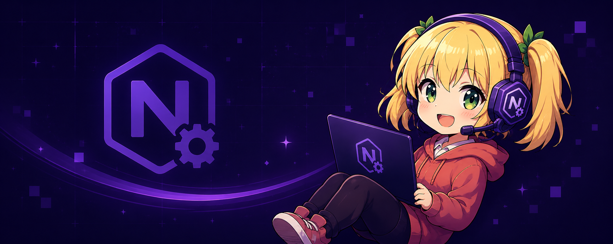

## 🌸 About NeneTech Industries

**NeneTech Ind.** is an independent development team founded by BennySpace (Vlasov Daniil) and Wesdmond (Timofey Shabanov) with full focus on building practical, modern and maintainable software.

Our current main project is **[NeneEngine](https://github.com/NeneTech-Ind/NeneEngine)** — a lightweight C++ game engine designed around clean architecture, ECS-based gameplay systems and fast prototyping.

We **truly** value:
- simple and readable code;
- modular architecture;
- experimentation without unnecessary complexity.

## 🛠️ Our tech stack

<p>  </p>

```cpp
// There is no icon for DirectX12 and WinAPI :(
```

## 🤝 Contributing

The organization is currently in an early stage but feedback and bug reports in issues are welcome.

## 📫 Contact

For questions, suggestions (maybe even collaboration):

NeneTech.Ind@proton.me
